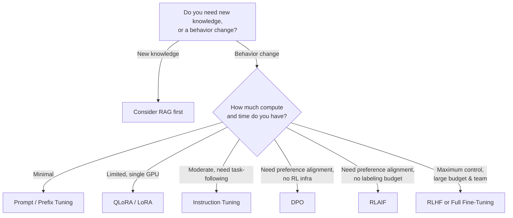

# LLM Fine-Tuning Techniques: A Practical Guide

> A field guide to the major fine-tuning techniques for large language models — what they are, what they cost, how they compare, and what architects and leadership should weigh before picking one.

---

## Table of Contents

- [Why this guide exists](#why-this-guide-exists)
- [The techniques](#the-techniques)
- [Cost, time & complexity comparison](#cost-time--complexity-comparison)
- [Decision guide: what to consider before choosing](#decision-guide-what-to-consider-before-choosing)
- [Guardrails](#guardrails)
- [Use cases & who's using what](#use-cases--whos-using-what)
- [Quick decision flow](#quick-decision-flow)
- [Further reading](#further-reading)

---

## Why this guide exists

"Fine-tuning" gets used as a catch-all term, but it actually spans a wide spectrum of techniques with very different cost, engineering, and risk profiles. Picking the wrong one can mean burning weeks of GPU time on a full retrain when a lightweight adapter would have done the job — or, conversely, under-investing in alignment work for a customer-facing product that needed it.

This guide breaks down the major techniques, compares them side by side, and gives architects and leadership a shared vocabulary for making that call.

---

## The techniques

| # | Technique | What it does | Reference |
|---|-----------|--------------|-----------|
| 1 | **Prompt Tuning** | Freezes the entire model and learns a small set of "soft prompt" embeddings prepended to the input — no model weights change at all. | [Lester et al., 2021 — *The Power of Scale for Parameter-Efficient Prompt Tuning*](https://arxiv.org/abs/2104.08691) |
| 2 | **Prefix Tuning** | Similar idea, but learns a small trainable prefix injected into every transformer layer's activations, not just the input embedding. | [Li & Liang, 2021 — *Prefix-Tuning: Optimizing Continuous Prompts for Generation*](https://arxiv.org/abs/2101.00190) |
| 3 | **Adapters** | Inserts small trainable bottleneck modules between the frozen layers of the network; only the adapters are trained. | [Houlsby et al., 2019 — *Parameter-Efficient Transfer Learning for NLP*](https://arxiv.org/abs/1902.00751) |
| 4 | **LoRA** (Low-Rank Adaptation) | Freezes the base weights and injects small trainable low-rank matrices into each layer, dramatically cutting trainable parameters. | [Hu et al., 2021 — *LoRA: Low-Rank Adaptation of Large Language Models*](https://arxiv.org/abs/2106.09685) |
| 5 | **QLoRA** | LoRA on top of a 4-bit quantized base model — lets you fine-tune huge models on a single GPU. | [Dettmers et al., 2023 — *QLoRA: Efficient Finetuning of Quantized LLMs*](https://arxiv.org/abs/2305.14314) |
| 6 | **Instruction Tuning** | Supervised fine-tuning on (instruction, response) pairs so a base model learns to follow directions across many tasks. | [Wei et al., 2021 — *Finetuned Language Models Are Zero-Shot Learners* (FLAN)](https://arxiv.org/abs/2109.01652) |
| 7 | **DPO** (Direct Preference Optimization) | Directly optimizes a model on human/AI preference pairs, skipping the separate reward model and RL loop that RLHF needs. | [Rafailov et al., 2023 — *Direct Preference Optimization: Your Language Model is Secretly a Reward Model*](https://arxiv.org/abs/2305.18290) |
| 8 | **RLAIF** (RL from AI Feedback) | Same idea as RLHF, but an AI model generates the preference labels instead of humans — trades label cost for label quality. | [Lee et al., 2023 — *RLAIF vs. RLHF: Scaling Reinforcement Learning from Human Feedback with AI Feedback*](https://arxiv.org/abs/2309.00267) |
| 9 | **RLHF** (RL from Human Feedback) | A reward model trained on human preference rankings guides further tuning via reinforcement learning (typically PPO). | [Ouyang et al., 2022 — *Training Language Models to Follow Instructions with Human Feedback* (InstructGPT)](https://arxiv.org/abs/2203.02155) |
| 10 | **Full Fine-Tuning** | Updates every parameter in the model on your dataset — the most powerful and most expensive option. | [Hugging Face — *Fine-tuning a pretrained model*](https://huggingface.co/docs/transformers/en/training) |

---

## Cost, time & complexity comparison

| Technique | Relative Cost | Relative Training Time | Complexity | Typical Hardware |
|---|:---:|:---:|:---:|---|
| Prompt Tuning | 💲 Very Low | Fast (hours) | ⭐ Very Low | Single GPU, even modest ones |
| Prefix Tuning | 💲 Very Low | Fast (hours) | ⭐⭐ Low | Single GPU |
| Adapters | 💲 Low | Fast (hours) | ⭐⭐ Low | Single GPU |
| QLoRA | 💲 Low | Fast–Moderate (hours–1 day) | ⭐⭐ Low–Medium | Single consumer/prosumer GPU (4-bit quantized) |
| LoRA | 💲💲 Low–Medium | Fast–Moderate (hours–1 day) | ⭐⭐ Medium | Single to few GPUs |
| Instruction Tuning | 💲💲 Medium | Moderate (days) | ⭐⭐⭐ Medium | Few GPUs (often LoRA-based under the hood) |
| DPO | 💲💲 Medium | Moderate (days) | ⭐⭐⭐ Medium | Few GPUs; needs a preference-pair dataset |
| RLAIF | 💲💲💲 Medium–High | Slow (days–weeks) | ⭐⭐⭐⭐ High | Multi-GPU; needs an AI "judge" model + RL loop |
| RLHF | 💲💲💲💲 High | Slow (weeks) | ⭐⭐⭐⭐⭐ Very High | Multi-GPU cluster; human labeling pipeline + reward model + RL |
| Full Fine-Tuning | 💲💲💲💲💲 Very High | Slowest (weeks+) | ⭐⭐⭐⭐⭐ Very High | Multi-GPU/TPU cluster |

**Reading the table:** cost and time scale with model size in every row — a full fine-tune of a 1B model can be cheaper than a QLoRA run on a 70B model. Treat this as *relative ranking*, not absolute pricing.

**Rule of thumb:**
- **Cheapest entry point:** Prompt/Prefix Tuning or QLoRA
- **Best cost-to-performance ratio for most production use cases:** LoRA, often paired with DPO for alignment
- **Reserve for when you truly need maximum control:** RLHF and Full Fine-Tuning

---

## Decision guide: what to consider before choosing

### For Architects

- **Is this a knowledge problem or a behavior problem?** If the model just needs access to facts it doesn't have, **retrieval-augmented generation (RAG) may beat fine-tuning entirely** — fine-tuning is better suited to changing *how* a model responds (tone, format, task-following) than teaching it new facts.
- **Multi-tenancy needs.** If you're serving many customers or use cases off one base model, lightweight methods (LoRA, adapters, prompt tuning) let you swap in small per-tenant weights cheaply, without hosting a full model copy per customer.
- **Iteration speed.** How often will this need to be retrained? Lightweight methods let you retrain in hours when requirements shift; full fine-tuning and RLHF make every iteration expensive, so they suit stable, well-understood requirements.
- **Data volume and quality.** RLHF/DPO need well-curated preference data; instruction tuning needs clean instruction-response pairs; PEFT methods (LoRA/QLoRA/adapters) can work with comparatively small, high-quality task datasets.
- **Infrastructure reality.** QLoRA exists specifically because most teams don't have a cluster of 80GB GPUs sitting idle. Match the technique to the hardware you actually have, not the hardware in the paper.
- **Reversibility.** LoRA adapters can be merged, swapped, or removed independently of the base model. Full fine-tuning bakes changes into the weights permanently — rolling back means re-deploying an old checkpoint.

### For Leadership

- **Total cost of ownership, not just training cost.** Factor in hosting, retraining cadence, evaluation, and the team needed to maintain the pipeline — not just the one-time compute bill.
- **Time to value.** Lightweight techniques can go from idea to production in days; RLHF programs are often multi-month efforts requiring a labeling operation.
- **Risk tolerance.** Techniques that reshape model *behavior* at a deep level (RLHF, full fine-tuning) carry more risk of unintended side effects (regressions on unrelated tasks, safety drift) and need more rigorous evaluation before shipping.
- **Build vs. buy.** Many vendors now offer managed fine-tuning (including LoRA/QLoRA-based) as an API — evaluate whether an in-house pipeline is actually differentiating, or whether a managed offering gets you there faster and cheaper.
- **Talent and staffing.** RLHF and RLAIF require ML engineers comfortable with reinforcement learning, plus (for RLHF) a human labeling operation. PEFT methods can often be run by a smaller applied ML team.
- **Start small, escalate deliberately.** The strongest pattern across the industry: start with the lightest technique that could plausibly work, measure it against real evaluation criteria, and escalate only when you hit a real ceiling — not by default.

---

## Guardrails

Regardless of which technique you choose, put these in place:

- **Data governance.** Screen training and preference data for PII, secrets, and copyrighted content before it goes anywhere near a training run. This applies just as much to a 500-example LoRA dataset as to a full fine-tune corpus.
- **Held-out evaluation, every time.** Measure the fine-tuned model against a held-out test set *and* your original general-capability benchmarks. Catastrophic forgetting (regressing on things the base model used to do well) is a real risk in full fine-tuning and can quietly show up in PEFT methods too if the rank/learning rate is too aggressive.
- **Reward hacking checks (RLHF/DPO/RLAIF).** Preference-optimized models can learn to exploit quirks in the reward signal (e.g., being verbose because raters liked longer answers) rather than genuinely improving. Regularly spot-check outputs against the actual intent, not just the reward score.
- **Bias and safety review.** Preference data reflects the biases of whoever (or whatever model) generated it. Audit preference/instruction datasets for skew before training, and red-team the resulting model before shipping.
- **Version control and reproducibility.** Track dataset versions, hyperparameters, and adapter/checkpoint versions with the same rigor as application code. "Which LoRA adapter is in production" should always be an answerable question.
- **Base model licensing.** Confirm the base model's license permits your intended commercial use *before* investing in fine-tuning it — this is easy to overlook and expensive to discover late.
- **Human oversight for RLHF pipelines.** Define clear labeler guidelines, measure inter-rater agreement, and ensure labeler pools are diverse enough not to encode a narrow set of preferences as "the" human preference.
- **Rollback plan.** Always keep the prior checkpoint/adapter deployable. Treat a fine-tuned model release like any other production release: staged rollout, monitoring, and a fast rollback path.
- **Cost ceilings.** Especially for RLHF/RLAIF/full fine-tuning, set a compute budget and evaluation checkpoint *before* the run starts — these techniques can silently consume far more compute than planned if left unchecked.

---

## Use cases & who's using what

| Technique | Example use case | Company / project |
|---|---|---|
| **Prompt Tuning** | Serving many downstream tasks from a single frozen model by swapping in task-specific soft prompts instead of separate models per task | **Google Research** — introduced the technique for efficiently multi-tasking T5-scale models |
| **Prefix Tuning** | Controllable generation (e.g., steering tone or task) without fine-tuning or duplicating the underlying model | **Stanford NLP** (Li & Liang) — foundational technique now widely used in low-resource dialogue and generation research |
| **Adapters** | One base model serving many languages/domains, each with its own lightweight, swappable adapter module | **Google Research** — originated the technique; adopted widely via the open-source **AdapterHub** ecosystem |
| **LoRA** | Cheaply customizing a large foundation model per customer, task, or style without hosting a full model copy for each | **Microsoft** — developed LoRA and open-sourced it; now a default technique across the parameter-efficient fine-tuning ecosystem |
| **QLoRA** | Fine-tuning a 65B-parameter model on a single 48GB GPU for a capable open chatbot | **University of Washington** — produced the **Guanaco** models, reaching 99.3% of ChatGPT's quality on the Vicuna benchmark after ~24 hours of fine-tuning on one GPU |
| **Instruction Tuning** | Turning a raw base model into one that reliably follows natural-language directions across many tasks | **Google** (the **FLAN** models) and **Databricks** (**Dolly**, an instruction-tuned open model built for enterprise use) |
| **DPO** | Aligning a small open model to be more helpful, without building a full RLHF pipeline | **Hugging Face** — built **Zephyr-7B** by applying DPO directly on top of Mistral-7B, reaching top-ranked performance among 7B chat models at release |
| **RLAIF** | Scaling up alignment/safety tuning without a large human-labeling operation | **Google DeepMind** (RLAIF research) and **Anthropic**, whose **Constitutional AI** approach uses AI-generated feedback to help align **Claude** |
| **RLHF** | Making a general-purpose chatbot follow instructions helpfully and safely at consumer scale | **OpenAI** — InstructGPT and ChatGPT were trained using RLHF |
| **Full Fine-Tuning** | Deeply changing what a model understands about a specific domain of language | **Google** — fine-tuned BERT to improve Search's understanding of natural-language queries (the 2019 "BERT update") |

---

## Quick decision flow

---

## Further reading

- [Hugging Face PEFT library](https://github.com/huggingface/peft) — production-grade implementations of LoRA, prefix tuning, prompt tuning, and more
- [Hugging Face TRL library](https://github.com/huggingface/trl) — implementations of DPO, RLHF/PPO, and related alignment techniques
- [Hugging Face Alignment Handbook](https://github.com/huggingface/alignment-handbook) — the recipes used to train Zephyr, as a real-world reference pipeline

---

*Contributions welcome — if you've applied one of these techniques in production and have numbers or lessons to share, open a PR.*
